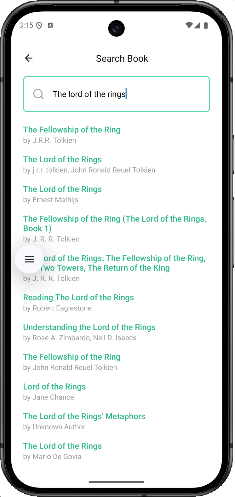
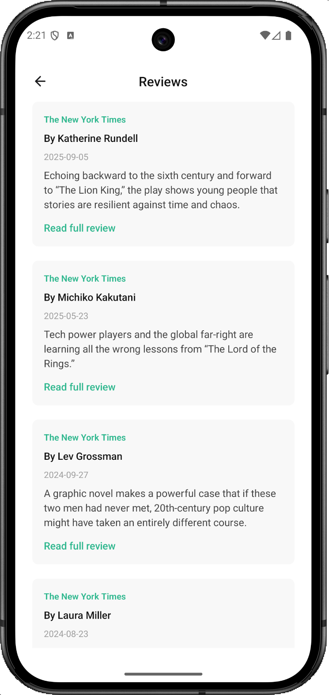

# Book Explorer

A React Native & TypeScript mobile application made with Expo, that allows users to explore information about books and ratings. Search for books dynamically, view detailed book information, and read reviews from The New York Times.

## Table of Contents

- [Features](#features)
- [Tech Stack](#tech-stack)
- [APIs Used](#apis-used)
- [API Endpoints & Service](#api-endpoints--service)
  - [Endpoints](#endpoints)
  - [Service Functions](#service-functions)
- [Project Structure](#project-structure)
- [Prerequisites](#prerequisites)
- [Installation & Setup](#installation--setup)
- [Running the App](#running-the-app)
- [Testing](#testing)
- [Usage](#usage)
  - [Search for Books](#search-for-books)
  - [View Book Details](#view-book-details)
  - [Read Reviews](#read-reviews)
- [Screenshots](#screenshots)
- [Architecture Decisions](#architecture-decisions)
  - [Throttling vs Debouncing](#throttling-vs-debouncing)
  - [Race Condition Handling](#race-condition-handling)
  - [Transform Functions](#transform-functions)
- [Contributing](#contributing)

## Features

- **Dynamic Book Search**: Search results appear as you type with throttled API calls for optimal performance
- **Book Details**: View comprehensive book information including cover, title, author, publication date, ratings, and description
- **NYTimes Reviews**: Read professional book reviews from The New York Times
- **Star Ratings**: Visual star rating display with support for half-stars
- **Error Handling**: Graceful error handling with meaningful error messages
- **Loading States**: Smooth loading indicators during data fetches

## Tech Stack

- **Framework**: React Native with Expo SDK 54
- **Language**: TypeScript
- **Navigation**: Expo Router (file-based routing)
- **State Management**: React Hooks (useState, useEffect, useMemo, useRef)
- **Icons**: Lucide React Native, Expo Vector Icons (FontAwesome)
- **Testing**: Jest, React Native Testing Library

## APIs Used

| API | Purpose |
|-----|---------|
| [Google Books API](https://developers.google.com/books) | Book search, details, cover images, ratings |
| [NYTimes Article Search API](https://developer.nytimes.com/docs/articlesearch-product/1/overview) | Professional book reviews |

## API Endpoints & Service

All API logic is centralized in `src/services/api.ts`.

### Endpoints

| API | Base URL | Authentication |
|-----|----------|----------------|
| Google Books | `https://www.googleapis.com/books/v1/volumes` | API Key (query param) |
| NYTimes Article Search | `https://api.nytimes.com/svc/search/v2/articlesearch.json` | API Key (query param) |

### Service Functions

#### `searchBooks(query, maxResults?)`

Searches for books matching the query string.

| Parameter | Type | Default | Description |
|-----------|------|---------|-------------|
| `query` | `string` | - | Search term (title, author, ISBN) |
| `maxResults` | `number` | `30` | Maximum results to return |

**Request:**
```
GET https://www.googleapis.com/books/v1/volumes?q={query}&maxResults={maxResults}&key={API_KEY}
```

**Returns:** `Promise<Book[]>`

---

#### `getBookById(bookId)`

Fetches detailed information for a specific book.

| Parameter | Type | Description |
|-----------|------|-------------|
| `bookId` | `string` | Google Books volume ID |

**Request:**
```
GET https://www.googleapis.com/books/v1/volumes/{bookId}?key={API_KEY}
```

**Returns:** `Promise<Book>`

---

#### `getBookReviews(title?)`

Searches for NYTimes book reviews by title.

| Parameter | Type | Description |
|-----------|------|-------------|
| `title` | `string` | Book title to search reviews for |

**Request:**
```
GET https://api.nytimes.com/svc/search/v2/articlesearch.json?fq={filters}&sort=relevance&api-key={API_KEY}
```

**Filter Query (`fq`):**
```
"{title}" AND typeOfMaterials:"Review" AND section.name:"Books"
```

**Returns:** `Promise<BookReview[]>`

---

## Project Structure

```
src/
├── app/                          # Expo Router screens
│   ├── _layout.tsx               # Root layout with navigation
│   ├── index.tsx                 # Home screen
│   ├── search.tsx                # Search screen
│   └── books/
│       └── [id]/
│           ├── index.tsx         # Book details screen
│           └── reviews.tsx       # Book reviews screen
├── components/                   # Reusable UI components
│   ├── BackButton.tsx
│   ├── ErrorMessage.tsx
│   ├── LoadingSpinner.tsx
│   ├── RatingStars.tsx
│   ├── SearchBar.tsx
│   └── SearchButton.tsx
├── hooks/                        # Custom React hooks
│   ├── useBookSearch.ts          # Dynamic search with throttling
│   ├── useBookDetails.ts         # Fetch book details
│   └── useBookReviews.ts         # Fetch NYTimes reviews
├── services/
│   └── api.ts                    # API functions
├── types/
│   └── index.ts                  # TypeScript interfaces
├── utils/
│   ├── cleanHtml.ts              # HTML tag remover
│   ├── throttle.ts               # Throttling utility for search
│   └── transforms.ts             # API response transformers
└── __tests__/                    # Unit tests
    ├── components/
    │   └── SearchBar.test.tsx
    └── services/
        └── api.test.ts
```

## Prerequisites

- Node.js (v18 or higher)
- npm or yarn
- Expo CLI (`npm install -g expo-cli`)
- Expo Go app (for physical device testing) or Android/iOS emulator

## Installation & Setup

1. **Clone the repository**

   ```bash
   git clone https://github.com/yourusername/book-explorer.git
   cd book-explorer
   ```

2. **Install dependencies**

   ```bash
   npm install
   ```

3. **Set up environment variables**

   Create a `.env` file in the project root (refer to .env.example to understand structure):

   ```env
   EXPO_PUBLIC_GOOGLE_BOOKS_API_KEY=your_google_books_api_key
   EXPO_PUBLIC_NYTIMES_API_KEY=your_nytimes_api_key
   ```

   **Getting API Keys:**
   - Google Books API: [Google Cloud Console](https://console.cloud.google.com/) → Create a new project → Enable Books API → Create credentials
   - NYTimes API: [NYTimes Developer Portal](https://developer.nytimes.com/) → Create new app → Generate API key → Enable Article Search API from APIs list

4. **Start the development server**

   ```bash
   npx expo start
   ```

## Running the App

After starting the development server:

- **Android Emulator**: Press `a` in the terminal
- **iOS Simulator**: Press `i` in the terminal (macOS only)
- **Physical Device**: Scan the QR code with Expo Go app

### Other Commands

```bash
# Start with cache cleared
npx expo start --clear

# Run on Android
npm run android

# Run on iOS
npm run ios

# Run linter
npm run lint
```

## Testing

Run the test suite:

```bash
npm test
```

### Test Coverage

| Component/Service | Tests |
|-------------------|-------|
| API Service | Search, getBookById, getBookReviews, error handling |
| SearchBar | Rendering, input handling, focus states |

## Usage

### Search for Books

1. Open the app and navigate to the search screen
2. Type a book title or author name in the search bar
3. Results appear dynamically as you type
4. Tap on a book to view details

### View Book Details

- See cover image, title, author, and publication date
- View star ratings from Google Books
- Read book description/overview
- Access publisher and page count information

### Read Reviews

- From the book details screen, tap on the reviews link
- View professional reviews from The New York Times
- Tap "Read full review" to open the complete article on The New York Time website

## Screenshots

| Welcome Screen | Search Screen | Search Results | Book Details Screen |
|-------------|----------------|--------------|---------|
|  |  |  |  |

<br>

| Book Details Screen | Reviews Screen | Error Message | Not Found Message |
|-------------|----------------|--------------|---------|
|  |  |  |  |

## Architecture Decisions

### Throttling vs Debouncing

The app uses **throttling** (not debouncing) for the search functionality:
- Throttle fires at regular intervals while typing, providing progressive results
- Better user experience with "live" search feel
- API calls are rate-limited to prevent excessive requests

### Race Condition Handling

The search hook uses a `latestQueryRef` to track the current query:
- Prevents stale API responses from overwriting newer results
- Ensures UI always reflects the most recent search

### Transform Functions

API responses are transformed to normalized app types:
- Decouples UI from API structure
- Handles edge cases (missing fields, http→https conversion)
- Single source of truth for data shape

## Contributing

1. Fork the repository
2. Create a feature branch (`git checkout -b feature/amazing-feature`)
3. Commit your changes (`git commit -m 'Add amazing feature'`)
4. Push to the branch (`git push origin feature/amazing-feature`)
5. Open a Pull Request

---